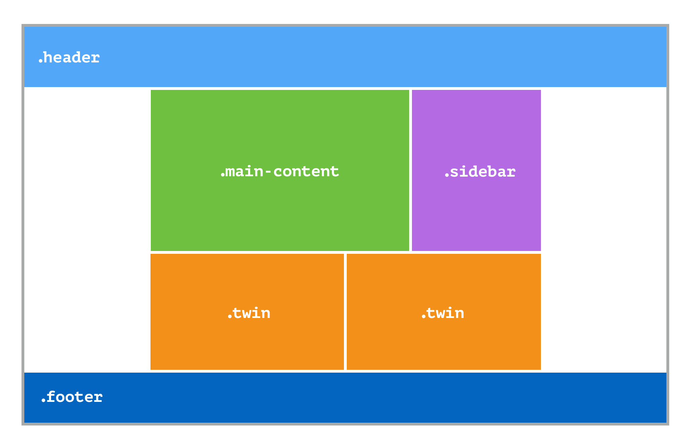
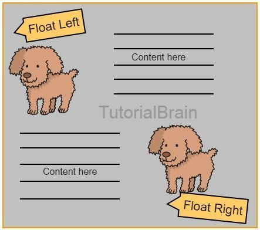

# css-layout-study
- created : 2020-10-03
- 목적 : CSS 레이아웃에 대해서 좀 더 친숙해지고 익숙해지기 위한 학습
- 참고 : 새로운 CSS 레이아웃(http://www.yes24.com/Product/Goods/60715949)

## 우리가 지나온 길
- CSS 레이아웃 제작 방법에 대해서 지난 역사에 대해서 간략하게 살펴보자.
> 초기 CSS 레이아웃은 **float** 또는 **position** 속성이 설정된 엘리먼트의 조합으로 이루어졌다.

> 인기 있는 형식은 메인 컨텐츠 왼쪽 또는 오른쪽에 넓은 margin 을 주고 그 여백에 절대 좌표를 사용해 sidebar 를 두는 것이었다.🤔 괜찮은 방법이지만, footer 를 두려고 하거나 메인 컨텐츠보다 sidebar 가 길어질 수 있는 상황에는 맞지 않는 레이아웃이었다. 시간이 흐르면서 레이아웃을 만드는 방법은 점점 더 발전했으며, 다양한 CSS 레이아웃 예제를 복사해서 사용할 수 있도록 온라인 커뮤니티가 만든 누들 인시던트(https://www.thenoodleincident.com/) 같은 사이트는 아직 건재하다.
> floating 레이아웃(float 속성이 적용된 엘리먼트)을 만들 수 있게 되자 꽉 찬 높이의 컬럼이 없다는 것이 불만이 되었다. 이를 해결하고자 가짜 컬럼(faux column) 기법을 사용해 꽉 찬 높이의 컬럼 문제를 해결하였다.(이는 모양을 속이는 여러 기법 중 하나에 불과하다.)
> 아이폰이 등장하면서 반응형 웹디자인에 패러다임이 바뀌었다.(기존에는 고정 너비 방식으로 의존했으나, 반응형이 모든것에 영향을 미치기 시작하여 가변적인 퍼센트 기반 그리드를 사용한 디자인을 만들어야 했다.) -> 기존의 기술과 노하우들이 무너졌고 **float** 를 비롯한 다른 CSS 의 기능을 어떻게 사용해야 레이아웃을 더 쉽게 만들 수 있을지 새로운 고민이 시작되었다.😲

---

## float 의 문제
- **float** 속성은 CSS 초창기부터 다중 컬럼 레이아웃을 만들 때 자주 사용해온 방식이다.
- float 는 원래 이미지 등의 요소 주위에 텍스트를 둘러 표현할 때 사용할 디자인 패턴으로 고안되었다.

- float 엘리먼트의 너비를 정확하게 계산하면 마치 컬럼처럼 엘리먼트를 한 줄로 나란하게 배열할 수 있다.
- **예시 : https://codesandbox.io/s/css-reiaus-yeje-ntxdl**
> 😭 앗? 그런데 카드2가 내용이 조금 길어지면 의도하지 않게 레이아웃이 망가진다. 실질적인 해결 방법은 그리드의 가 줄을 wrapper 라는 하나의 요소로 감싸는 것이다. 그리고 wrapper 에는 **clear:both** 를 적용해 두 번째 줄에 있는 요소가 첫 번째 줄의 공간을 침범하지 않도록 한다. 괜찮은 방법이지만, 줄마다 새로운 마크업을 추가해야 하는 번거로움이 있다. 대신 사용할 수 있는 방법으로는 플로팅이 적용된 요소에 **display : inline-block** 을 적용하는 것이 있다. inline 엘리먼트에는 공백을 그대로 유지한다는 특성이 있다. **결론적으로 float 또는 inline-block 이 적용된 레이아웃을 사용하면 약간의 타협은 필요하지만 그럭저럭 정돈된 그리드 레이아웃을 구현할 수 있다. 하지만 엘리먼트의 배경색이나 외곽선, 컨텐츠의 크기만큼 늘어나므로 들쑥날쑥하게 된다.**

- display : table 속성은 CSS 테이블 레이아웃이라는 CSS 명세와 관련이 있다. 말그대로 HTML 표를 꾸밀 때 쓰일 속성이다. display : table / display : table-row / display : table-cell -> 그러나 뜻하지 않게 div 나 목록 등에도 적용할 수 있다. -> 😰 이 테이블의 줄과 칸에는 margin 이 적용되지 않는다. cell 사이의 간격을 넓히 때는 display : table 속성이 적용된 요소에 border-spacing 속성을 사용한다. 여기서 vertical-align 속성을 사용한다면 HTML 테이블과 마찬가지로 각 칸 안에 있는 컨텐츠를 수직 정렬할 수 있다.

- 👉 오래된 브라우저까지 지원하려면 이러한 기법을 알고 있어야 한다. 하지만 이러한 방법은 레이아웃을 만들 때만 사용할뿐 전문적인 레이아웃 시스템에는 미치지 못한다. CSS 레이아웃이 어렵고 불안정해 보이는 이유가 바로 여기에 있다. 레이아웃 도구가 없다. 이러한 문제와 오랫동안 시름한 끝에 커뮤니티는 레이아웃 문제를 해결할 도구를 직접 만들었다. 이러한 도구가 현재 어떤 영향을 미치는지 살펴보자.

---

## 레이아웃 제작의 현재
- 모범사례를 포함하여 전처리기와 후처리기에 이르기까지 다양한 도구가 탄생되었다. 그뿐 아니라 그들의 관심은 프레임워크를 넘어 최근에는 디자인 시스템과 패턴 라이브러리, 재사용 가능한 컴포넌트로 작업하는 영역까지 확장되었다.
- **CSS 아키텍처** : 한동안 프로그래밍 스타일 가이드가 유행했다. 이러한 가이드는 공인된 기존 원칙을 따를 때로 있고 팀에서 동의한 공통 규칙을 따를 때도 있다. CSS 아키텍쳐에는 **OOCSS / SMACSS / BEM 등** 다양한 접근 방식이 있다. 팀에서 CSS 를 다루는 사람이 한 명뿐이라면 이러한 방법이 과하다고 생각할 수 있다. 하지만 CSS 를 다루는 사람이 많고 그들이 각기 자신의 방식으로 작업하는 프로젝트에서 일하게 되면 이러한 아키텍처가 유용하다는 사실을 금세 깨닫게 될 것이다.
- **전처리기 / 후처리기** : 최근 몇 년간 개발 도구 덕분에 CSS 를 직접 손대지 않고도 작성하는 사람이 늘었다. 전처리기(preprocessor)는 SASS / LESS 와 같이 CSS 가 아닌 언어로 CSS 를 작성하면 이를 CSS 로 컴파일해주는 도구다. 후처리기(postprocessor)는 CSS 파일이 작성된 후에 적용된다. Autoprefixer 가 후처리기의 좋은 예다. Autoprefixer 를 사용하면 CSS 파일에 구식 브라우저에 필요한 접두어를 추가해준다. 이러한 도구들은 시간을 상당히 아껴준다. 정형화된 아키텍처와 마찬가지로 CSS 작업의 고통을 덜 수 있다. 이러한 도구는 긍정적인 영향과 더불어 CSS 작업에도 많은 변화를 가져왔다. 이제는 매일 CSS 를 작성하는 대신 SASS(SCSS) 를 작성한다. 어떻게 보면 우리는 현실에 있는 CSS 명세와 동떨어졌다. 사용 중인 전처리기에 따라 한계가 정해지기 때문에 향후 등장할 신기술을 지나치게 될 수도 있다. 아무 생각 없이 후처리기를 실행해 불필요한 접두어를 추가하는 일도 생길 수 있다. 😣가끔은 또는 잠시라도 CSS 현실세계를 바라보는것도 필요하다.
- **컴포넌트 우선 디자인** : 정형화된 아키텍처와 전처리기 덕분에 웹디자인꼐에도 컴포넌트를 조합해 페이지를 제작하는 방식이 유행했다. 브래드 프로스트(Brad Frost) 는 이러한 기법을 가리켜 아토믹 디자인(Atomic design)이라고 했다. 관련 개념으로는 각 컴포넌트를 상세히 설명하는 스타일 가이드나 디자인 시스템이 있다. 스타일 가이드나 디자인 시스템은 컴포넌트를 조합해 만드는 완성된 웹 페이지와는 별개로 존재한다. 이러한 제작 방식은 빈 페이지부터 시작해서 디자인을 완성해가는 대신에 가장 작은 컴포넌트부터 시작해서 점차 바깥으로 확장하며 디자인할 것을 권장한다. 이 방식은 프론트엔드 개발자가 1명인 팀에는 조금 과한 면이 있다. 디자이너의 작업과는 별개로 실제 작업자에게 전달해야 할 산출물이 발생할 수도 있다. 컴포넌트 우선 디자인 방식은 컴포넌트가 아니라, **페이지 단위**로 사고하던 초기의 웹 디자인과는 많이 동떨어진다.
- **프레임워크** : 모던 웹디자인에 관한 토론은 언제나 모든 웹사이트가 정도의 차이는 있을지언정 똑같아 보인다는 이야기로 마무리된다. 이러한 몽타주식 웹사이트의 주범은 bootstrap / material 같은 프레임워크다. 개발자는 웹 디자인을 몰라도 웹 사이트를 만들 수 있게 되었다. 프레임워크를 사용하면 개성 있어 보이지는 않지만 적어도 개발자가 만든 사이트처럼 끔찍하지는 않다. 프레임워크는 플로팅 기반의 레이아웃을 제작할 때 겪어야 할 수많은 복잡한 작업을 대신한다. 계산도 대신하기 때문에 각 중단점에서 우리가 원하는 비율로 나누어진 컬럼을 쉽게 만들 수 있다. 프레임워크 문서를 살펴보며 자신이 만들고 싶은 패턴을 찾아 복사해서 사용하면 그만이다. 하지만 프레임워크 떄문에 많은 프론트엔드 개발자가 CSS 를 거의 작성하지 않게 되면서 프레임워크 없이는 아무것도 할 수 없게 되었다. 
- **접근성** : 웹앱을 제작할때 접근성이라는 주제를 빼놓을 수 없다. 새로운 레이아웃 제작 방식은 레이아웃이 시각적 표현이나 키보드 내비게이션과 일치하지 않게 만들 수 있으므로 잠재적인 접근성 문제가 존재한다. 새로운 레이아웃 제작 방식에서 소스 코드상의 순서와 상관없이 화면상에 표현되는 순서를 정할 수 있는 방법을 다룬다. 새로운 명세 덕분에 시작적인 표현 순서를 재배열할 수 있게 된 만큼 이를 세심하게 주의를 기울여서 사용해야 한다.
- **자동으로 업데이트되는 브라우저** : 구식 브라우저의 존재는 웹 개발자들에게 항상 골칫거리였다.😡 대다수 사용자가 구식 브라우저를 고집하는 시기에는 큰 문제로 대두되기도 했다.(IE..) 이 문제는 웹의 역사에서 계속 반복되고 있다. 크롬 / 파이어폭스는 브라우저가 자동으로 업데이트된다. 사파리 / 엣지는 OS 출시와 함께 업데이트된다. 보안상의 이유로 웹 브라우저를 자동으로 업데이트하는 일에 익숙해진 사용자가 점점 늘고있다. 자동으로 업데이트되는 좋은 브라우저를 모든 사람이 사용했으면 좋겠지만 현실은 그렇게 단순하지 않으며 최신 브라우저를 사용하는 사용자도 많지만 내부 정책 때문에 사용할 수 있는 브라우저 버전이 제한된 사람도 여전히 있다. OS 가 새 버전을 지원하지 않아서 특정 브라우저 버전에 계속 머물어 있는 사람도 있다.(구식 윈도우 사용자는 IE11 이나 엣지 브라우저를 설치 할 수 없다.) 이러한 문제는 모바일 기기 사용자에게도 나타난다. OS를 업데이트하지 못하는 안드로이드 사용자를 생각해보자. 전 세계의 모든 사람이 자신의 브라우저를 최신 버전으로 유지하는 것을 아니지만 그래도 몇 년 전보다는 상황이 대체로 나아졌다. 파이어폭스 / 크롬에 탑재되었거나 구현될 것이라고 발표된 최신 기능을 사용해도 좋다. 한 번 만들어진 웹디자인은 몇 년 이상 유지될 것이므로 몇 달 후면 모든 크롬 사용자가 그 최신 기능을 보게 될 것이다.
- **CSS 학습의 외주화** : 대략 10년 전(대충 2009 ~ 2010년 시점) 프론트엔드 라는 새로운 분야가 구체화 되었다. 이전에는 브라우저 버그 전문가 + HTML 코더나 다름없이 일하던 때였다. 당시에는 CSS 가 너무 제한적이었으며, 브라우저 버그도 많았던 시절이다. 현재는 브라우저 버그도 훨씬 적고 CSS 제작방식도 아양화 되었지만 아직도 CSS 와 버그와 씨름해야 하는 것은 마찬가지다. 우리는 성능이 좋고 접근성이 보장된 웹앱을 완성하여 사업상의 목표를 달성하고 사용자를 기쁘게 하기 위해 애쓴다. 이러한 작업은 웹앱을 혼자 디자인하고 개발하는 1인부터 각 구성원이 컴포넌트 수준에서 딱 필요한 부분만 작성하는 거대 조직에 이르기까지 어떤 형태의 개발 환경에서든 이루어진다. 프레임워크, 전처리기, 후처리기 또는 그 밖의 프론트엔드 개발 작업을 편하게 해주는 도구는 무엇을 사용하든 본질적으로 문제 될 것이 없다. 현실에서 우리는 현실적이지 않은 예산 한도 내에서 웹앱을 빠르게 제작하고 배포해야 하며 IE8 에서도 크롬에서 보는 것과 똑같이 보이게 해달라고 고집하는 고객을 상대해야 한다. 하지만 프론트엔드 개발을 모두 프레임워크에만 의존한다면 텍스트 편집기를 열고 레이아웃을 처음부터 제작하려고 할 때 머릿속이 새하얘져서 아무 기억이 안 날 수도 있다.🥶 새로운 접근 방법이나 명세는 어떻게 배울것인가? 프레임워크에 맞추어 창의력을 제한할 것인가? 자신이 좋아하는 도구와 프레임워크 너머에 있는 가능성을 보기를 바란다.(🧐 CSS 의 잠재력을 살펴보고 작동원리에 대해 더 잘 이해했으면 하는 바람이다.)
