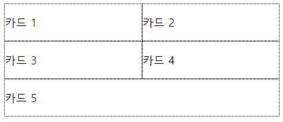

# css-layout-study
- created : 2020-10-03
- 목적 : CSS 레이아웃에 대해서 좀 더 친숙해지고 익숙해지기 위한 학습
- 참고 : 새로운 CSS 레이아웃(http://www.yes24.com/Product/Goods/60715949)

## 우리가 지나온 길
- CSS 레이아웃 제작 방법에 대해서 지난 역사에 대해서 간략하게 살펴보자.
> 초기 CSS 레이아웃은 **float** 또는 **position** 속성이 설정된 엘리먼트의 조합으로 이루어졌다.


> 인기 있는 형식은 메인 컨텐츠 왼쪽 또는 오른쪽에 넓은 margin 을 주고 그 여백에 절대 좌표를 사용해 sidebar 를 두는 것이었다.🤔 괜찮은 방법이지만, footer 를 두려고 하거나 메인 컨텐츠보다 sidebar 가 길어질 수 있는 상황에는 맞지 않는 레이아웃이었다. 시간이 흐르면서 레이아웃을 만드는 방법은 점점 더 발전했으며, 다양한 CSS 레이아웃 예제를 복사해서 사용할 수 있도록 온라인 커뮤니티가 만든 누들 인시던트(https://www.thenoodleincident.com/) 같은 사이트는 아직 건재하다.
> floating 레이아웃(float 속성이 적용된 엘리먼트)을 만들 수 있게 되자 꽉 찬 높이의 컬럼이 없다는 것이 불만이 되었다. 이를 해결하고자 가짜 컬럼(faux column) 기법을 사용해 꽉 찬 높이의 컬럼 문제를 해결하였다.(이는 모양을 속이는 여러 기법 중 하나에 불과하다.)
> 아이폰이 등장하면서 반응형 웹디자인에 패러다임이 바뀌었다.(기존에는 고정 너비 방식으로 의존했으나, 반응형이 모든것에 영향을 미치기 시작하여 가변적인 퍼센트 기반 그리드를 사용한 디자인을 만들어야 했다.) -> 기존의 기술과 노하우들이 무너졌고 **float** 를 비롯한 다른 CSS 의 기능을 어떻게 사용해야 레이아웃을 더 쉽게 만들 수 있을지 새로운 고민이 시작되었다.😲

---

## float 의 문제
- **float** 속성은 CSS 초창기부터 다중 컬럼 레이아웃을 만들 때 자주 사용해온 방식이다.
- float 는 원래 이미지 등의 요소 주위에 텍스트를 둘러 표현할 때 사용할 디자인 패턴으로 고안되었다.

- float 엘리먼트의 너비를 정확하게 계산하면 마치 컬럼처럼 엘리먼트를 한 줄로 나란하게 배열할 수 있다.
- **예시 : https://codesandbox.io/s/css-reiaus-yeje-ntxdl**
> 😭 앗? 그런데 카드2가 내용이 조금 길어지면 의도하지 않게 레이아웃이 망가진다. 실질적인 해결 방법은 그리드의 가 줄을 wrapper 라는 하나의 요소로 감싸는 것이다. 그리고 wrapper 에는 **clear:both** 를 적용해 두 번째 줄에 있는 요소가 첫 번째 줄의 공간을 침범하지 않도록 한다. 괜찮은 방법이지만, 줄마다 새로운 마크업을 추가해야 하는 번거로움이 있다. 대신 사용할 수 있는 방법으로는 플로팅이 적용된 요소에 **display : inline-block** 을 적용하는 것이 있다. inline 엘리먼트에는 공백을 그대로 유지한다는 특성이 있다. **결론적으로 float 또는 inline-block 이 적용된 레이아웃을 사용하면 약간의 타협은 필요하지만 그럭저럭 정돈된 그리드 레이아웃을 구현할 수 있다. 하지만 엘리먼트의 배경색이나 외곽선, 컨텐츠의 크기만큼 늘어나므로 들쑥날쑥하게 된다.**

- display : table 속성은 CSS 테이블 레이아웃이라는 CSS 명세와 관련이 있다. 말그대로 HTML 표를 꾸밀 때 쓰일 속성이다. display : table / display : table-row / display : table-cell -> 그러나 뜻하지 않게 div 나 목록 등에도 적용할 수 있다. -> 😰 이 테이블의 줄과 칸에는 margin 이 적용되지 않는다. cell 사이의 간격을 넓히 때는 display : table 속성이 적용된 요소에 border-spacing 속성을 사용한다. 여기서 vertical-align 속성을 사용한다면 HTML 테이블과 마찬가지로 각 칸 안에 있는 컨텐츠를 수직 정렬할 수 있다.

- 👉 오래된 브라우저까지 지원하려면 이러한 기법을 알고 있어야 한다. 하지만 이러한 방법은 레이아웃을 만들 때만 사용할뿐 전문적인 레이아웃 시스템에는 미치지 못한다. CSS 레이아웃이 어렵고 불안정해 보이는 이유가 바로 여기에 있다. 레이아웃 도구가 없다. 이러한 문제와 오랫동안 시름한 끝에 커뮤니티는 레이아웃 문제를 해결할 도구를 직접 만들었다. 이러한 도구가 현재 어떤 영향을 미치는지 살펴보자.

---

## 레이아웃 제작의 현재
- 모범사례를 포함하여 전처리기와 후처리기에 이르기까지 다양한 도구가 탄생되었다. 그뿐 아니라 그들의 관심은 프레임워크를 넘어 최근에는 디자인 시스템과 패턴 라이브러리, 재사용 가능한 컴포넌트로 작업하는 영역까지 확장되었다.
- **CSS 아키텍처** : 한동안 프로그래밍 스타일 가이드가 유행했다. 이러한 가이드는 공인된 기존 원칙을 따를 때로 있고 팀에서 동의한 공통 규칙을 따를 때도 있다. CSS 아키텍쳐에는 **OOCSS / SMACSS / BEM 등** 다양한 접근 방식이 있다. 팀에서 CSS 를 다루는 사람이 한 명뿐이라면 이러한 방법이 과하다고 생각할 수 있다. 하지만 CSS 를 다루는 사람이 많고 그들이 각기 자신의 방식으로 작업하는 프로젝트에서 일하게 되면 이러한 아키텍처가 유용하다는 사실을 금세 깨닫게 될 것이다.
- **전처리기 / 후처리기** : 최근 몇 년간 개발 도구 덕분에 CSS 를 직접 손대지 않고도 작성하는 사람이 늘었다. 전처리기(preprocessor)는 SASS / LESS 와 같이 CSS 가 아닌 언어로 CSS 를 작성하면 이를 CSS 로 컴파일해주는 도구다. 후처리기(postprocessor)는 CSS 파일이 작성된 후에 적용된다. Autoprefixer 가 후처리기의 좋은 예다. Autoprefixer 를 사용하면 CSS 파일에 구식 브라우저에 필요한 접두어를 추가해준다. 이러한 도구들은 시간을 상당히 아껴준다. 정형화된 아키텍처와 마찬가지로 CSS 작업의 고통을 덜 수 있다. 이러한 도구는 긍정적인 영향과 더불어 CSS 작업에도 많은 변화를 가져왔다. 이제는 매일 CSS 를 작성하는 대신 SASS(SCSS) 를 작성한다. 어떻게 보면 우리는 현실에 있는 CSS 명세와 동떨어졌다. 사용 중인 전처리기에 따라 한계가 정해지기 때문에 향후 등장할 신기술을 지나치게 될 수도 있다. 아무 생각 없이 후처리기를 실행해 불필요한 접두어를 추가하는 일도 생길 수 있다. 😣가끔은 또는 잠시라도 CSS 현실세계를 바라보는것도 필요하다.
- **컴포넌트 우선 디자인** : 정형화된 아키텍처와 전처리기 덕분에 웹디자인꼐에도 컴포넌트를 조합해 페이지를 제작하는 방식이 유행했다. 브래드 프로스트(Brad Frost) 는 이러한 기법을 가리켜 아토믹 디자인(Atomic design)이라고 했다. 관련 개념으로는 각 컴포넌트를 상세히 설명하는 스타일 가이드나 디자인 시스템이 있다. 스타일 가이드나 디자인 시스템은 컴포넌트를 조합해 만드는 완성된 웹 페이지와는 별개로 존재한다. 이러한 제작 방식은 빈 페이지부터 시작해서 디자인을 완성해가는 대신에 가장 작은 컴포넌트부터 시작해서 점차 바깥으로 확장하며 디자인할 것을 권장한다. 이 방식은 프론트엔드 개발자가 1명인 팀에는 조금 과한 면이 있다. 디자이너의 작업과는 별개로 실제 작업자에게 전달해야 할 산출물이 발생할 수도 있다. 컴포넌트 우선 디자인 방식은 컴포넌트가 아니라, **페이지 단위**로 사고하던 초기의 웹 디자인과는 많이 동떨어진다.
- **프레임워크** : 모던 웹디자인에 관한 토론은 언제나 모든 웹사이트가 정도의 차이는 있을지언정 똑같아 보인다는 이야기로 마무리된다. 이러한 몽타주식 웹사이트의 주범은 bootstrap / material 같은 프레임워크다. 개발자는 웹 디자인을 몰라도 웹 사이트를 만들 수 있게 되었다. 프레임워크를 사용하면 개성 있어 보이지는 않지만 적어도 개발자가 만든 사이트처럼 끔찍하지는 않다. 프레임워크는 플로팅 기반의 레이아웃을 제작할 때 겪어야 할 수많은 복잡한 작업을 대신한다. 계산도 대신하기 때문에 각 중단점에서 우리가 원하는 비율로 나누어진 컬럼을 쉽게 만들 수 있다. 프레임워크 문서를 살펴보며 자신이 만들고 싶은 패턴을 찾아 복사해서 사용하면 그만이다. 하지만 프레임워크 떄문에 많은 프론트엔드 개발자가 CSS 를 거의 작성하지 않게 되면서 프레임워크 없이는 아무것도 할 수 없게 되었다. 
- **접근성** : 웹앱을 제작할때 접근성이라는 주제를 빼놓을 수 없다. 새로운 레이아웃 제작 방식은 레이아웃이 시각적 표현이나 키보드 내비게이션과 일치하지 않게 만들 수 있으므로 잠재적인 접근성 문제가 존재한다. 새로운 레이아웃 제작 방식에서 소스 코드상의 순서와 상관없이 화면상에 표현되는 순서를 정할 수 있는 방법을 다룬다. 새로운 명세 덕분에 시작적인 표현 순서를 재배열할 수 있게 된 만큼 이를 세심하게 주의를 기울여서 사용해야 한다.
- **자동으로 업데이트되는 브라우저** : 구식 브라우저의 존재는 웹 개발자들에게 항상 골칫거리였다.😡 대다수 사용자가 구식 브라우저를 고집하는 시기에는 큰 문제로 대두되기도 했다.(IE..) 이 문제는 웹의 역사에서 계속 반복되고 있다. 크롬 / 파이어폭스는 브라우저가 자동으로 업데이트된다. 사파리 / 엣지는 OS 출시와 함께 업데이트된다. 보안상의 이유로 웹 브라우저를 자동으로 업데이트하는 일에 익숙해진 사용자가 점점 늘고있다. 자동으로 업데이트되는 좋은 브라우저를 모든 사람이 사용했으면 좋겠지만 현실은 그렇게 단순하지 않으며 최신 브라우저를 사용하는 사용자도 많지만 내부 정책 때문에 사용할 수 있는 브라우저 버전이 제한된 사람도 여전히 있다. OS 가 새 버전을 지원하지 않아서 특정 브라우저 버전에 계속 머물어 있는 사람도 있다.(구식 윈도우 사용자는 IE11 이나 엣지 브라우저를 설치 할 수 없다.) 이러한 문제는 모바일 기기 사용자에게도 나타난다. OS를 업데이트하지 못하는 안드로이드 사용자를 생각해보자. 전 세계의 모든 사람이 자신의 브라우저를 최신 버전으로 유지하는 것을 아니지만 그래도 몇 년 전보다는 상황이 대체로 나아졌다. 파이어폭스 / 크롬에 탑재되었거나 구현될 것이라고 발표된 최신 기능을 사용해도 좋다. 한 번 만들어진 웹디자인은 몇 년 이상 유지될 것이므로 몇 달 후면 모든 크롬 사용자가 그 최신 기능을 보게 될 것이다.
- **CSS 학습의 외주화** : 대략 10년 전(대충 2009 ~ 2010년 시점) 프론트엔드 라는 새로운 분야가 구체화 되었다. 이전에는 브라우저 버그 전문가 + HTML 코더나 다름없이 일하던 때였다. 당시에는 CSS 가 너무 제한적이었으며, 브라우저 버그도 많았던 시절이다. 현재는 브라우저 버그도 훨씬 적고 CSS 제작방식도 아양화 되었지만 아직도 CSS 와 버그와 씨름해야 하는 것은 마찬가지다. 우리는 성능이 좋고 접근성이 보장된 웹앱을 완성하여 사업상의 목표를 달성하고 사용자를 기쁘게 하기 위해 애쓴다. 이러한 작업은 웹앱을 혼자 디자인하고 개발하는 1인부터 각 구성원이 컴포넌트 수준에서 딱 필요한 부분만 작성하는 거대 조직에 이르기까지 어떤 형태의 개발 환경에서든 이루어진다. 프레임워크, 전처리기, 후처리기 또는 그 밖의 프론트엔드 개발 작업을 편하게 해주는 도구는 무엇을 사용하든 본질적으로 문제 될 것이 없다. 현실에서 우리는 현실적이지 않은 예산 한도 내에서 웹앱을 빠르게 제작하고 배포해야 하며 IE8 에서도 크롬에서 보는 것과 똑같이 보이게 해달라고 고집하는 고객을 상대해야 한다. 하지만 프론트엔드 개발을 모두 프레임워크에만 의존한다면 텍스트 편집기를 열고 레이아웃을 처음부터 제작하려고 할 때 머릿속이 새하얘져서 아무 기억이 안 날 수도 있다.🥶 새로운 접근 방법이나 명세는 어떻게 배울것인가? 프레임워크에 맞추어 창의력을 제한할 것인가? 자신이 좋아하는 도구와 프레임워크 너머에 있는 가능성을 보기를 바란다.(🧐 CSS 의 잠재력을 살펴보고 작동원리에 대해 더 잘 이해했으면 하는 바람이다.)

---

## 새로운 레이아웃
- CSS 의 양식화 문맥 : CSS 디스플레이 명세에서는 양식화 문맥(formatting context)을 다음과 같이 정의한다.
> 연관된 박스 세트가 배치되는 환경이다. 양식화 문맥이 다르면 다른 규칙에 따라 박스를 배치한다. 예르 들어 flex 양식화 문맥은 CSS3 FLEXBOX 라는 플렉스 레이아웃 규칙에 따라 박스를 배치하고, 블록 양식화 문맥은 CSS2 의 블록과 인라인 레이아웃 규칙에 따라 박스를 배치한다.

- Block fomatting context(블록 양식화 문맥) : 요소에 새로운 블록 양식화 문맥(BFC)을 작성하면 그 요소의 자식요소에 적용할 독립적인 레이아웃 환경을 만들 수 있다.
```
- 루트 요소일 때
- 플로팅(Floating) 되었을 때(float : left, float : right)
- position 속성이 absolute 로 적용되어 있을 때
- display 속성이 inline-block 으로 적용되어 있을 때
- overflow 속성의 값이 visible 이외의 값으로 적용되어 있을 때
```

```

<div class="container">
  <div class="box">
    <p>플로팅 엘리먼트</p>
  </div>
</div>


.container {
  width: 400px;
  border: 2px solid blue;
  border-radius: 5px;
}

.box {
  float: left;
  width: 200px;
  border: 2px solid #e5dbff;
  border-radius: 5px;
  padding: 10px;
}

```
> box가 플로팅되면 부모인 container 가 줄어든다. container 요소에 BFC 를 만들어주면 플로팅된 box 가 container 안으로 들어간다. display 속성의 flow-root 값을 이용하여 BFC를 만들수 있다.

```
.container {
  position : absolute;
  //...
}

or

.container {
  display : flow-root;
  //...
}
```
> 위와 같이 처리해주면, container 엘리먼트가 새로운 BFC 를 만들어서 box 가 흐름에서 벗어나지 않는다.

- 흐름 내부와 외부 : 위 내용에서 컨테이너 안의 플로팅된 박스에 관해 설명할 대 컨테이너가 줄어들었고 요소가 흐름에서 벗어났다고 이야기했다. **흐름 내부에 있는 요소는 자신의 양식화 모델에 따라 표현된다.** block level 요소의 양식화 모델에 따르면 별다른 제약이 없는 경우 요소는 컨테이너의 너비만큼 넓어지고 새로운 줄에 표현된다. inline 요소는 공간이 있을 경우 다른 요소 바로 뒤에 표시된다.
> 요소를 플로팅하거나 ```position : absolute / position : fixed``` 를 적용하면 요소가 흐름에서 벗어난다. 플로팅된 요소는 블록 수준의 요소를 만날 때까지 위로 이동하고 그 뒤의 요소들은 플로팅된 요소 옆에 늘어선다. 텍스트는 플로팅된 요소 주변으로 배치되지만 박스는 텍스트를 감싸기 위해 줄어든다.

```
<div class="container">

  <div class="box">
    <p>플로팅되어 흐름에서 벗어난 요소</p>
  </div>

  <p>컨테이너 내부의 텍스트 단락. 흐름 내부에 있다. 텍스트는 플로팅된 요소 주변으로 배치되지만 배경색은 플로팅된 요소 뒤쪽에도 표시된다.</p>
</div>

.container {
  width: 400px;
  border: 1px solid skyblue;
  border-radius: 5px;
  overflow: hidden;
}
.box {
  float: left;
  width: 200px;
  border: 1px solid skyblue;
  border-radius: 5px;
  padding: 10px;
}
.box > p {
  background-color: greenyellow;
}
.container > p {
  background-color: orange;
}
```

---

## 플로트
- CSS 형태 명세(CSS Shapes specification) 레벨 1에 정의된 shape-outside 속성을 사용하고 싶다면 플로트 속성을 반드시 익혀야 한다. 이 명세의 현재 버전에 따라 웹 브라우저는 현재 플로팅된 요소에만 shape-outside 속성을 허용한다. (shape-outside: circle(50%);)
- 큰 문제가 없는 한 플로팅된 요소를 사용해 다중 컬럼 레이아웃을 제작했던 예전 방식은 서서히 사라질 것이다. float 는 너무 남발하지 말고 안맞은 곳에만 사용하자.

---

## 위치 정하기
- position 속성, 특히 position : absolute 는 CSS 레이아웃을 제작하던 초기에 많이 쓰던 방법이다.
- 정적위치(static) : position 속성을 적용하지 않으면 이 속성의 기본값은 static 이다. 일반적인 흐름안에서 코드상에 출현한 순서대로 표시된다.
- 상대위치(relative) : position : relative 속성을 적용해도 눈에 뛰는 변화가 나타나지 않는다. 여기에 좌표를 정해주는 top, right, bottom, left 같은 오프셋(offset) 속성을 무엇이든 하나 추가해주면 요소가 원래 있던 위치에서 조금 이동한다. 이 속성이 설정된 요소는 새로운 컨테이너 블록이 된다는 점을 기억하자.
- 절대위치(absolute) : position : absolute 속성을 설정하면 흐름에서 벗어나고 자신이 포함된 컨테이너 블록의 가장자리를 기준으로 오프셋 속성을 설정된 만큼 이동한다. 컨테이너 블록이 별도로 설정되어 있지 않다면 viewport 가 컨테이너 블록이 된다. 이 박스를 컨테이너 안쪽에 표시하고, 컨테이너 가장자리를 기준으로 오프셋 위치가 계산되도록 하고 싶다면 컨테이너에 position : relative 를 추가해 주면 된다.(만약 높이 속성을 주지 않은경우 absolute 속성을 준 요소를 내부에 표시할 수 없는 높이가 되며, 그러면 해당 요소는 흐름에서 벗어나 원래 의도한 레이아웃이 만들어지지 않는다.)
- 고정위치(fixed) : position : fixed 속성을 설정하면 설정된 위치에 요소가 나타난다. 페이지를 스크롤하면 다른 컨텐츠처럼 절대 위치가 설덩된 요소도 스크롤 된다.(고정된 위치에 존재하고 페이지를 스크롤해도 그 자리를 유지한다.) 고정 위치가 적용된 요소는 viewport 를 기준으로 오프셋을 설정한다. 고정 위치 요소는 흐름에서 벗어나 컨텐츠 위에 겹쳐서 표시된다.
- 접착위치(sticky) : position : sticky 속성을 적용하면 되고 정적위치와 고정위치를 섞어놓은 듯이 동작한다. 문서가 스크롤되기 전에는 정적 위치 요소처럼 동작하다가 문서 스크롤이 일정한 위치에 도달하면 공정 위치 요소처럼 동작한다. IE 에서는 지원되지 않는다.(JS 로 구현이 가능하다.) 접착 위치 요소는 흐름에 따라 표시되고 페이지 스크롤을 그대로 따른다.

---

## 다중 컬럼 레이아웃
- 다중 컬럼 레이아웃(multi-column layout)은 컨텐츠를 신문처럼 여러 단으로 나누는 방식을 이야기 한다.
- 다중 컬럼 레이아웃은 사용하기 굉장히 쉬우며, 컨텐츠를 3컬럼으로 나누고 싶다면 ```column-count``` 속성에 원하는 만큼의 컬럼을 숫자로 값으로 설정.
- ```column-width``` 속성을 사용해 컬럼의 너비를 설정할 수도 있다.
- ```column-gap``` 속성을 사용해 컬럼들 사이에 여백을 설정할 수도 있다.
```
#col {
  -webkit-column-count: 2;
  column-count: 2;
  /* column-width : 300px; */
}

<div id="col">
  우마 유튜브 핵꿀잼 개꿀잼! 풍월량도 재미있어요!
  우마 유튜브 핵꿀잼 개꿀잼! 풍월량도 재미있어요!
  우마 유튜브 핵꿀잼 개꿀잼! 풍월량도 재미있어요!
  우마 유튜브 핵꿀잼 개꿀잼! 풍월량도 재미있어요!
  우마 유튜브 핵꿀잼 개꿀잼! 풍월량도 재미있어요!
</div>

```
- ```column-count``` 와 ```column-width``` 속성을 함께 사용하면 ```column-count``` 속성은 최대 컬럼 개수로 사용된다.
- ```column-width``` 속성을 사용할 때는 픽셀 너비를 정확하게 설정할 수 없다. 컨테이너에서 사용할 수 있는 공간에 따라 어느 정도 오차가 생긴다. 연속적인 컨텐츠를 여러 컬럼으로 나누어 배치할 방법은 이 명세가 유일하다. 다른 방법은 포함된 컨텐츠와 상관없이 컨텐츠의 흐름보다는 자식 요소에 작용한다는 차이가 있다.

---

## flex 박스
- flex box module 명세를 통해 반응형 또는 유연한 웹 디자인을 위한 기능을 갖춘 flex box 가 도입되면서 CSS 레이아웃이 변하기 시작했다.
- 요소를 ```display : flex``` 를 설정하면 요소의 항목은 flex item 으로 바뀐다. 또한 flex item 은 flex box 의 기본값에 따라 한 줄로 배열괴고 box 의 높이만큼 길이가 늘어난다.(모든 아이템은 그 안에 든 컨텐츠의 길이와 상관없이 높이가 같아진다.)


- 항목을 계속 추가하면 항목이 그 줄에 하나씩 늘어나며, **min-content** 로 설정한 넓이보다 작아 질 수 없으므로 결국에는 box 를 벗어난다. box 를 벗어나지 않게 하려면 여러줄에 표현될 수 있도록 ```flex-wrap : wrap``` 속성을 설정하면 된다.

```
<div class="flex-box">
  <div class="item">
    <p>
    카드 1
    </p>
  </div>
  <div class="item">
  <p>
    카드 2
    </p>
  </div>
  <div class="item">
  <p>
    카드 3
    </p>
  </div>
  <div class="item">
  <p>
    카드 4
    </p>
  </div>
  <div class="item">
  <p>
    카드 5
    </p>
  </div>

</div>

.flex-box {
  display: flex;
  flex-wrap: wrap;
  flex-direction: row;
}

.item {
  border: 1px dotted black;
  flex-grow : 1;
  flex-shrink : 1;
  flex-basis : 200px;
  box-sizing : border-box;
}

```



- flex item 이 다음줄로 넘어가면 새로운 줄이 flex box 가 된다. 이는 곧 각 줄마다 개별적으로 사용 가능한 공간을 할당한다는 뜻이다. flex box 는 바로 위나 아래에 있느 다른 flex box 와 선을 맞추어 정렬하지 않는다. 이를 가리켜 **1차원 레이아웃** 이라고 한다. flex box 가 grid 처럼 동작하게 하려면 flex box 의 핵심 기능인 유연성을 조금 제한해야 한다.(flex-grow, flex-shrink, flex-basis 속성 값들을 설정)
- 정말로 grid layout 을 만드는 것이 목적이라면 CSS grid layout 명세를 권한다.
